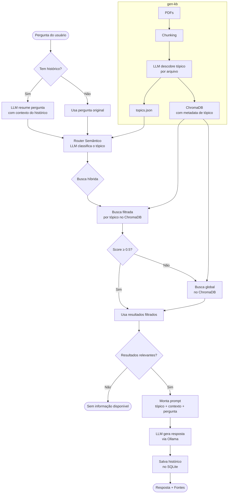

# Chatbot - Monitoria de Computação Gráfica

> _Esse projeto tem como objetivo desenvolver um chatbot para auxiliar na disciplina de Computação Gráfica, utilizando a abordagem de RAG (Retrieval Augmented Generation). O sistema utiliza materiais desenvolvidos pela professora e monitores, juntamente com livros de referência. O intuito é que o chatbot seja capaz de fornecer respostas precisas, contextualizadas e alinhadas ao conteúdo ministrado na sala de aula._

---

## Objetivo Geral
Desenvolver um chatbot que utiliza material selecionado para auxiliar alunos durante a disciplina de Computação Gráfica.

## Objetivos Específicos
- Garantir uma plataforma de estudo confiável, utilizando material personalizado alinhado com o conteúdo ministrado.
- Permitir o uso do chatbot em ambientes acadêmicos sem dependência de serviços pagos ou infraestrutura de servidor.

---

## Status Atual do Projeto
- **Status atual:** Em desenvolvimento
---

## Equipe
| Nome | Função | Contato |
|------|--------|----------|
| Luana Batista da Cruz | Responsável | luana.batista@ufca.edu.br |
| Victor Cleyton de Andrade Chaves | Bolsista | victor.chaves@aluno.ufca.edu.br |

---

## Adaptações para Modelos Locais

O projeto original utilizava a API da OpenAI (GPT-4o Mini e Text-Embedding-3-Small) e o Redis como banco de dados de histórico. Embora funcional, essa abordagem impõe barreiras importantes em contextos acadêmicos:

- **Custo de uso**: A API da OpenAI é paga por token, o que inviabiliza o uso intensivo por alunos sem recursos financeiros.
- **Dependência de internet e de servidores externos**: Em ambientes com conectividade limitada, o chatbot simplesmente não funciona.
- **Privacidade**: Perguntas dos alunos são enviadas a servidores terceiros.

Para eliminar essas barreiras, o projeto foi adaptado para rodar inteiramente de forma local utilizando **Ollama** — uma plataforma open-source para execução de LLMs na própria máquina do usuário — e ferramentas de armazenamento que não exigem servidores em execução contínua.

### O que mudou

| Componente | Antes | Depois | Motivo |
|-----------|-------|--------|--------|
| Modelo de linguagem | GPT-4o Mini (OpenAI) | Ollama (ex: llama3.2) | Gratuito, local, sem internet |
| Modelo de embeddings | text-embedding-3-small (OpenAI) | nomic-embed-text (Ollama) | Gratuito, local, sem internet |
| Banco de histórico | Redis (servidor) | SQLite (arquivo local) | Sem necessidade de servidor |
| Banco vetorial | ChromaDB | ChromaDB | Mantido — já era local |
| Classificação de tópicos | Hardcoded | Automática via LLM | Extensível sem manutenção |

---

## Arquitetura com Router Semântico

A principal inovação arquitetural desta versão é a introdução de um **router semântico** combinado com uma **busca híbrida**. O objetivo é direcionar cada pergunta ao contexto mais relevante antes de realizar a busca na base de conhecimento, melhorando a qualidade das respostas e reduzindo o ruído de contexto.

### Por que usar um router semântico?

A base de conhecimento cobre múltiplos tópicos distintos (OpenGL, transformações geométricas, iluminação, viewing, etc.). Quando uma pergunta é feita diretamente sobre toda a base, os chunks recuperados podem misturar tópicos não relacionados, poluindo o contexto enviado ao LLM e degradando a resposta. O router resolve isso identificando o tema da pergunta antes da busca.

### Por que busca híbrida?

O router pode classificar incorretamente uma pergunta ambígua ou interdisciplinar. A busca híbrida protege contra esse erro: tenta primeiro uma busca filtrada pelo tópico detectado (mais precisa), e cai automaticamente para uma busca global (mais abrangente) caso os resultados filtrados não sejam suficientemente relevantes.

### Por que os tópicos são descobertos automaticamente?

Em vez de definir manualmente uma lista de tópicos, o `gen-kb.py` usa o próprio LLM para ler o nome e uma amostra de cada arquivo e inferir seu tema com uma chamada por arquivo. Isso torna o sistema extensível: adicionar novos materiais ao acervo não exige nenhuma alteração no código.

---

## Diagrama da Arquitetura



---

## Estrutura do Projeto
```
Chatbot-CG
 ├── docs                -> Documentação sobre o projeto
 │
 ├── src                 -> Implementações e códigos
 │    ├── Docs/          -> PDFs (Slides, Materiais de Apoio, Livro)
 │    ├── chroma/        -> Banco vetorial ChromaDB + topics.json
 │    ├── gen-kb.py      -> Constrói a base de conhecimento
 │    ├── chatbot.py     -> Chatbot com router semântico
 │    └── requirements.txt
 │
 └── README.md
```

---

## Métodos & Tecnologias Utilizadas

- **Python**: Linguagem principal do projeto.

- **Langchain**: Framework para orquestração de LLMs. Utilizado para carregamento de documentos, chunking, embeddings, integração com ChromaDB e encadeamento de prompts.

- **Ollama**: Plataforma open-source para execução local de LLMs. Permite rodar modelos como `llama3.2` e `nomic-embed-text` sem custo e sem internet.

- **ChromaDB**: Banco de dados vetorial local, utilizado para armazenar e consultar os embeddings dos documentos com suporte a filtros por metadata.

- **SQLite**: Banco de dados relacional embutido no Python, utilizado para persistir o histórico de conversas por usuário sem necessidade de servidor.

---

## Como Executar

### Pré-requisitos

1. Instalar o [Ollama](https://ollama.com) e baixar os modelos:
```bash
ollama pull llama3.2
ollama pull nomic-embed-text
```

2. Instalar as dependências Python (dentro de `src/`):
```bash
pip install -r requirements.txt
```

### Construir a base de conhecimento

Execute dentro de `src/`:
```bash
python gen-kb.py
```

O script irá:
- Carregar todos os PDFs da pasta `Docs/`
- Classificar automaticamente cada arquivo em um tópico via LLM
- Criar o banco vetorial em `chroma/` e salvar os tópicos em `chroma/topics.json`

### Executar o chatbot

```bash
python chatbot.py <chave_do_usuario> "<pergunta>"
```

A chave do usuário é usada para recuperar o histórico de conversas no SQLite. Exemplo:
```bash
python chatbot.py aluno123 "O que é pipeline gráfico?"
```

---

## Resultados Parciais / Relatórios
| Data | Progresso | Observações |
|------|-----------|-------------|
| 20/04/2026 | 100% concluído | Base do chatbot com OpenAI + Redis completa. |
| 28/04/2026 | Em andamento | Adaptação para Ollama + SQLite + router semântico híbrido. |
